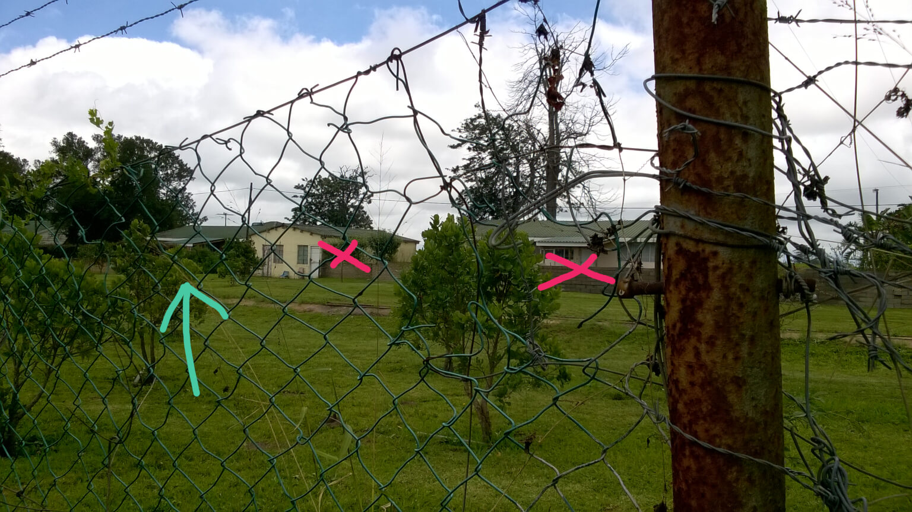

# Paddock

Moved here in 1978

---

## House 1

As far as I can ascertain the house where we lived is the one indicated with an arrow. The other houses had not been built yet (x'ed out).

* Train line running behind  
* Playing the mouth-organ on the water-tower  
* The Fishers  

**Mowing the 'lawn'**  

Geoff and I were tasked to mow the lawn in front of the house - more like a field than a lawn. It extended past the end of the property along the road towards the Farmers Hall. All we had was a push-mower effort and the grass was _long_, some of it up to about 50cm high (you have to try this sometime). We realised it was going to be a long morning and because we could only operate the machine one at a time we decided to take turns. We divided the grassed area up into sections, I took the first stint then handed over to Geoff while I sat on the fence watching. Geoff set to with a will and as he got going mom drove past on her way to the shop. We waved, she waved and was gone.

I took over, mowed my section then handed over to Geoff again. He was well into his second stint when mom drove past again, coming back from the shops. We waved, she waved and was gone.

I took over then handed over to Geoff who went into the last stretch. Mom drove past again, this time looking very concerned because every time she saw us Geoff was the one mowing while I relaxed on the fence. She must have thought I was being very, very lazy, or something, but what do you do? Timing is everything!

## Port Shepstone High School

* Deidre and Melanie[?] and the obstacle course  
* Mr. Greef, Michael van der Merwe and myself  
* Sport  

**The library**  
I discovered the school library early on and spent many lunch-breaks there [after munching a large lunch, packed by mom]. It was here that I first came across The Lord of the Rings and I booked it out and read it right through, an exercise I repeated every year for at least the next 8 years  

---

## House 2

* Lived here next [the big house across from the factory]  
* Playing the Vox guitar while sitting on the roof  
* Danny Duck  
* Chris and Lloyds Kentucky Braaied Chickens  

---

## Chiltley

* Lived here until we left for Johannesburg  
* Geoff’s driving skills  
* Oribi Gorge  
* Living in the ‘cottage’ with Geoff  
* The swimming pool  
* Chris learns to ride a BIG bicycle - one leg through the crossbars to pedal  

---

## Things to remember  

**Cows and chickens at Chiltley**  
The cows were named Kitchen and ??? Geoff and Jonathan C tried to ride the calf. The bullock stands on Geoff’s foot  

* Making butter in the scullery  
* Geoff and Jonathans’ bee keeping escapades  
* Catching the bus to school and back  

---

### The Factory   

**The One Tower**  

Here's a pic of the tower taken on the 10th December 2015:  

  

Deidre and I climbed the tower attached to the factory a number of times. The ladder only had space for one person at a time, and it was rather high, and somewhat dangerous, but the view from the top was quite spectacular.  

---

We spent a lot of time playing in and around the abandoned factory on the property. This included a covered siding for the local narrow-gauge trains just off the main line which was the regular service between Harding and Port Shepstone. Inside the factory there were empty offices, a boiler room, and large open areas where wattle bark and sugar-cane could be loaded onto the trains  

Paddock used to be the main factory for the Natal Tanning Extract Company Ltd but operations ceased there in the late 1960'. From their [website](http://www.nte.co.za/nte-history/):  

`Another factory located at Paddock was opened in 1921 with a capacity of 300 tons per month  

in 1927, the Paddock factory was converted into a bark buying depot and in 1937, repurposed as an extract factory.  

With the increased demand for wattle extract during and after the war, the NTE board decided to expand its property division. In addition, NTE also controlled three wattle growing subsidiary companies, namely Murchison Plains Black Wattle Company, Alfredia Wattle Company and the Ihluku Wattle Company, which between them owned 6 250 ha, 83% of which was under wattle, all three supplying the Paddock factory.  

The Paddock factory closed in 1967  
`

And we arrived in 1978!  

We found an old sugar-cane railway truck out in the open below the factory and decided to move it up into the factory and onto the rails where we could have some fun with it. This took a while and some planning because we had to lift it from one part of the factory up about 3m to the level where the tracks were. We eventually accomplished this then placed it on the rails inside the factory.  

We got it up to speed and jumped on with a view to running it through the factory and out the other side where there was a second siding. Unbeknownst to us someone had strung thick wire across the rails about 1.5m off the ground inside the factory - I guess to discourage exactly the behaviour we were engaging in. Luckily for us, it being for transporting sugarcane it had 4 poles attached vertically on each corner of the truck and with our weight and momentum we snapped the wires completely as we went. If it wasn't for the poles every one of us would have been yanked off the trolley and damaged in one way or another. For sure  

The other thing we didn't take into account was Mr. Jessop! He was a local employee who looked after the factory and turned the generator on each day and off every night (we had electricity until around 10:30-11:00 pm only). He came storming out of the office area and shouted at us as we rolled past. We ignored him and carried on going until we were well past the factory then jumped off and ran away. He didn't catch us....  

I remember finding some old fire extinguishers lying around, and emptying them! It made a huge racket throughout the factory - much fun!  

---

### Murchison  

* Bikes  
* Deidre’s first solo bike ride  
* The Camerons  
* Andrew Cameron and the taxi driver  
* YP at Murchison  
* Mrs. Cameron and the exploding ginger bottles  

**Guavas**  
We used to pick guavas off the trees in the orchard - they were freely available and much appreciated!  

**The bogey**  
I found a bogey in the factory. It came from one of the cane trolleys, and I decided to take it back to Chiltley to use as a barbell. I figured it would be an easy task to roll it all the way home on the railroad track which ran from the factory in Paddock all the way past Chiltley at a gentle incline. I placed it on the rails at the road crossing and started pushing it. I had to keep stopping it from running ahead because of the incline, but this became tedious after a while, so I thought I might run ahead of it and catch it further down the track. Things didn't work out so well, though.  

I ran ahead of it about 100m or so and waited for it to catch up, expecting it to trundle along at a reasonable pace but I didn't reckon on the effect gravity would have on a free-wheeling bogey on rails! I watched it's approach but soon realised that it was belting along at a rapid rate, and picking up speed as it went!  

I knew that it would break my leg or something if I stood in front of it and tried to stop it so I figured I would stand next to the tracks and try to derail it as it went past. This was a simple maneuvre to execute and I pulled it off (pun intended!), but the bogey went one way and I the other, right into the thick grass next to the tracks. Bar some scratches and scrapes I was alright. I retrieved the bogey from the track side and took it the rest of the way to Chiltley  

Here's a pic of the track near where I managed to derail the bogey (taken in December 2015):  

**Camping in Oribi Gorge with Peter Holmes**  
Peter picked us up at the C residence in his short-wheelbase Landrover and drove us to the Gorge. We trekked into the Gorge and eventually found a cliff with a massive overhang which we decided to use as our camp. We built a fire as darkness was falling then picked out places to bed down and sat around cooking something to munch, then we chatted away until we fell asleep. 

* Horses attacking Geoff
* Bike rides to Murchison and back
    * Petrol for 26c a litre
    * Cleaning out carburettors
* We would cut old tyre tubes up to make catties, and had much fun using the [still existing] windows on the factory exterior for target practice.
* Playing squash with Eric Fisher at the Farmer's Hall
* Oribi Gorge trek at the bottom of Chiltley
* Sahara's rugby jersey
* Mrs. Simpson, Roy Whipp and Mary [??]  
* Geoff's driving escapades  
* Deidre, Xolo and the horse  

---
