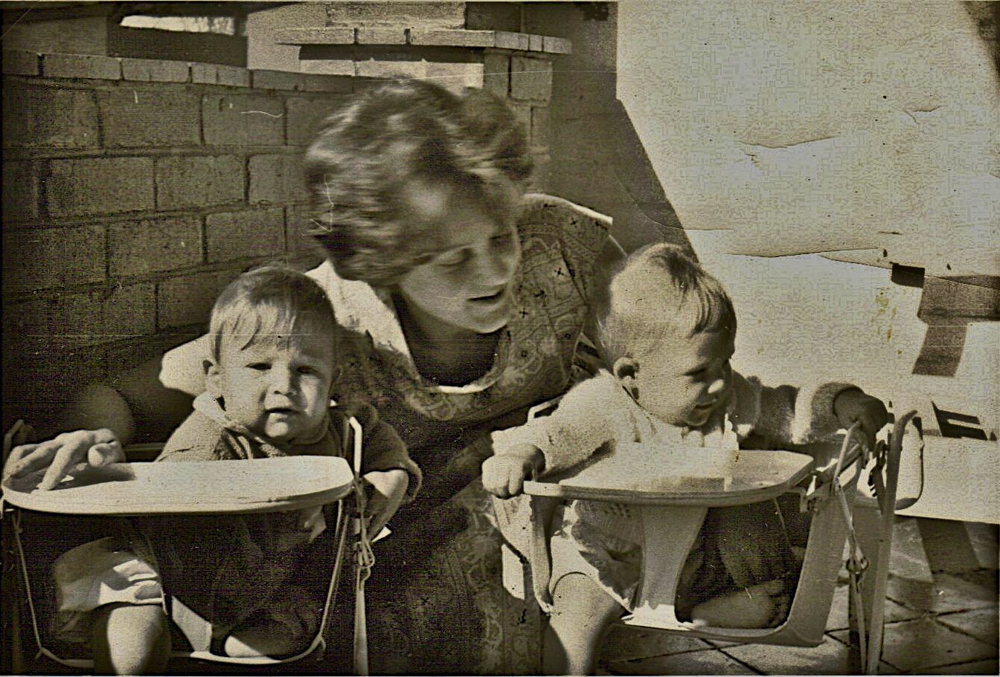
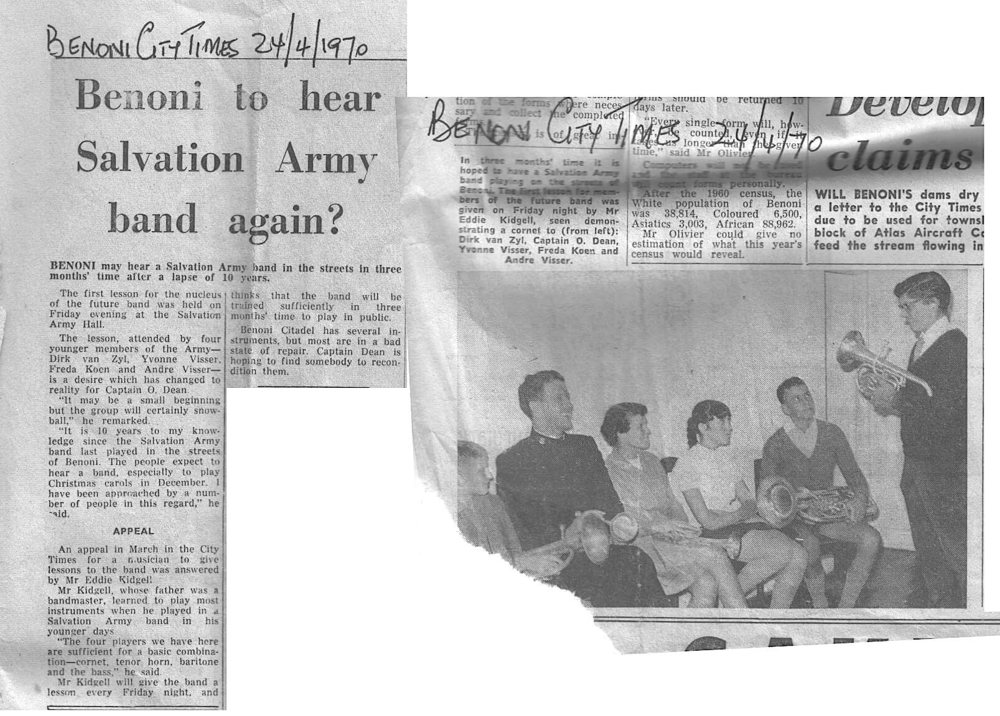
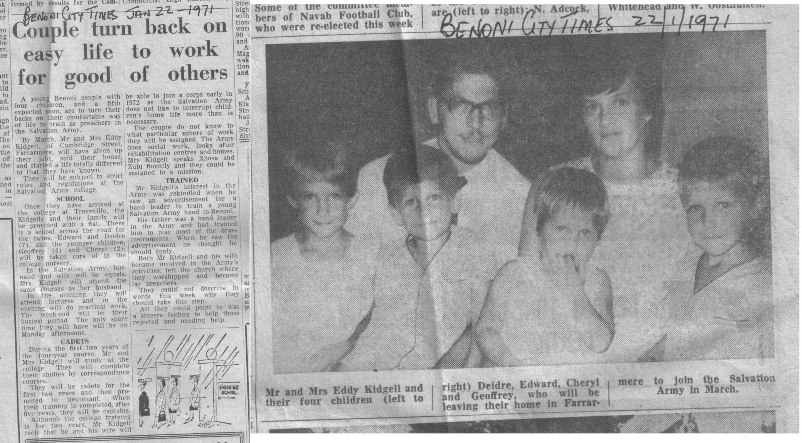
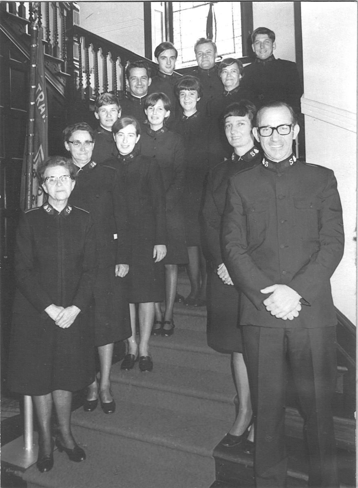

# Suggested Topics

----

## 63-65

Don’t remember this part but here's a pic from 1963!

----

## 66

Oakland’s Rd.

Mom rescuing Deidre and myself from the pine tree. In her dress. While pregnant! Then changing our minds with a ‘switch’  
Pulling wallpaper off under the bed. Mom and dad finding out later  
Peter Newton walking on his hands in the garden  
Geoff being born - seeing him for the first time  

----

## 67

Springs [??]

Punch and Judy  
Showing Geoff how to make the Hillman go ‘like a rocket’ by putting clods of sand into the petrol tank  
Getting punched by my ‘buddy’ from next door while building tents around the dining room table 

## 68

Cheryl arrives

## 69

Listening to the first moon landing transmission - July 20 1969.

----

## 70 

### Benoni

Start of school - Tom Newby - Meh!

Dad in action...

  

Deidre and I started playing music at the tender age of 6, my instrument 'of choice' was the cornet, Deidre's the tenor horn. We played in the Benoni Corps Youth Band - for the uninitiated, 'Corps' are what Salvation Army churches are called. My dad was the Bandmaster and taught us how to read and play. We practically were the Band!  

### Geoff

First memory getting stung by centipede thing in Benoni driveway  
Dad smoking  

Running through window with cowboy hat over face - first miracle as didn't get  a scratch  

> Ed: One day while dad was mowing the lawn the mower-blade connected with a bolt hidden in the grass and sent it flying through one of the bedroom windows. It was a miracle no-one was hurt. Some days later Geoff was running in the yard with his cowboy hat over his face (as one does!)  and he ran slap-bang into the same window, shattering it. I don't know how he wasn't cut by the glass. Another miracle!  

Biltong hanging in garage  
Cheryl being small  - eating sand. And singing a lot!  

> Ed:  
> The jungle-gym falling on me  
> The maid and the shoes  
> Dad driving over a scooter and thinking it was one of us kids  
> Learning to ride a bicycle and falling into the cactus  
> Having to catch the bus home, losing the 5c bus-fare and walking all the way home  
> Dad making us wooden houses painted white with red roofs 

## 71

Around March / April [??] [see article] - moving to the training college  

**The Trainee Officers**

Chris arrives  
Fairview Junior School  
Cocoa in winter every lunch break. No sugar  
Getting bitten for the first time  

### Geoff

Andrew Cooper making shields and painting them  
Mini Cooper green and cool  
Debbie cutting off her finger in uncle Ben's steel cutter  
Getting a hiding with a high heel from Lyn Tyler's wife  

Shooting out the light bulb with my camera water pistol  
> Ed: I remember this well. We shot one light out by accident, then decided to try another (which worked spectacularly) so we destroyed some more, but not all of them ('cos that would have been wasteful!)  

Uncle Ben chasing the guys that stole his kombi - caught them at the traffic lights (and beating them up)  
The pet chicken in the dolls house  

----

## 72 - July to 74 Dec

Kimberley - see [doc](kimberley.md)

---

## 75

### East London - see [doc](eastlondon.md)

----

## 76

### Johannesburg 

#### Franklin D. Roosevelt

Hiawatha  
Mr. Green 

#### Firlands Boys Home 

Judo  

At Jo'burg One [slang for the Corps based at Salvation Army Headquarters] we joined the Youth Band. This was the big time. These guys actually played stuff in keys other than C, F or G. Hectic. Learned how to read faster, and lip-tune some - you have to when you're playing the wrong fingering and your notes need some bending to fit the key. It must have sounded terrible!  

Simmonds Street  
Getting the pellet guns  
Chores 

----

## 77

### Paarl 

### Muldersvlei  

Link to map: <https://goo.gl/maps/jT6DWfEfHD8gvxVv5>  

Website: <https://www.hesketh.org.za/>  

The Story: <https://www.hesketh.org.za/our-story/>

Herding the cows and getting milk really cheaply [10c a litre, I think]  
The rinkhals  
Getting on the bus in the dark at mid-winter [mud, raining, cold]  
Kleilat and the train  
Playing down at the dam  
Braaing meat using paper only  
Building rafts [and losing galoshes in the sticky mud]  
The winery over the road [irony]  
Cheryl breaking a leg  
The cows: Nos. 34 and 43  
Mr. Pullen from the Old Men's Home - he flew Hurricanes and Spitfires in World War 2

### Paarl Boys High  

Link: <https://goo.gl/maps/pnwKMTedV9edD7FU9>  

Rugby in the rain...with bricks!  

## General  

Cape Town Corps  
Double-feature movies with Chris Lovick  

----

## 78  

Paddock - see [doc](paddock.md)  

Going through the Karoo on our way from Paarl up to Paddock via the Transkei  

----

## 79  

We moved back to Johannesburg in April and I joined the Roosevelt High School Cadet Band on trumpet. Got my half-colours for Band and in 1980, when Mr. Blackstock asked Pier Pucci - who was the band Drum Major if he would form a group to back singers for the school concert Pier asked if I would play guitar and so I joined him and his brother Rob, a drummer, to form the school band.  

### Firlands Boys Home  

Scalextric and model trains  
Snooker  

### Roosevelt High School  

**Rugby**  

**Athletics**  

I did the high-jump [Fosbury Flop] and 100m sprint, Deidre ran the 100m as well and set up some records that stood for a l-o-o-o-o-ng time  

## 80  

**Crusade ‘80**  

Magnet Music, T.O.M.S and Neil Fox  

## 81  

**Cadet Camp**  

**Grease**  

Rob getting a commendation for skiving off  
Getting out of doing cross-country  

### Chevenham  

Learning all the Boston songs  
Learning the Brick solo  
Grandpa passing away  
Catching the bus to school  
Snow in Joubert Park  
Samantha the Great Dane  

### Personal Transport  

**The Mini**  

**The DT 175**  

----

## General subjects  

The Pietermaritzburg Kidgells  

The Animals  

Who / when  

The Transkei - see [doc](transkei.md)  

----

## Format decisions  

Nail down the months and divide using them instead of year numbers  

----
