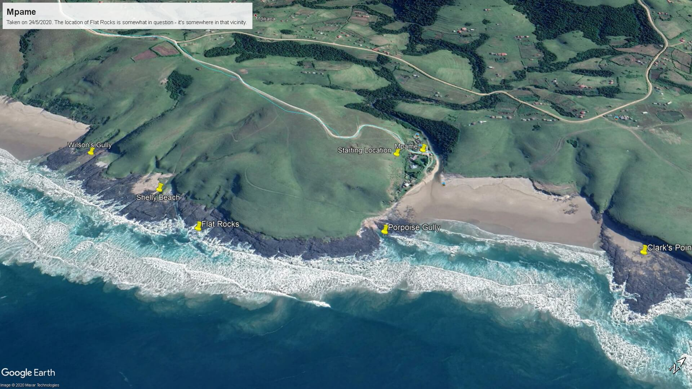
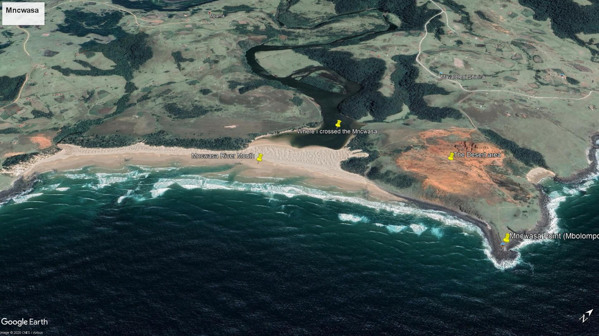

# Prospect and Mpame

## Mpame

### Places

Clark's Point  
The Sphinx  
Porpoise Gully  

**Flat Rocks**  

I remember fishing with Geoff at Flat Rocks the one time. The tide was coming in so we had to be careful - at high tide the rocks are completely covered, and the sea at the Wild Coast is, well, _wild_!  

We'd made our last-ditch casts and were thinking of packing up as we were already dodging waves when a fish took Geoff's line with a vengeance. I reeled my line in and scrambled to get our gear together while Geoff brought the fish in and onto the Flats. Because the waves were knee-deep we couldn't see what it was until he pulled it in close: the biggest Moonie I've ever seen! We just managed to make it back to the rocks before the tide came surging in _hard_, covering the Flats completely.  

**Shelly Beach**  

I found a strange fish one day at low tide at Shelly Beach. It was transparent with a luminous blue colour, about 35cm long and 1-2cm in the vertical. Always wondered what it was...  

Wilson's Gully  
The beach on the other side of Wilson’s  

**Mncwasa**

Crossing the Mncwasa River mouth on my own  
Mbolompo  
Hole in the Wall  

* The long walk  
* The desert area above Mbolompo

Walks along the coast  

---

### General

The drive down from Prospect, particularly the forest, and coming over the hill at Mpame and seeing it below  
Boating / swimming / fishing / prawning[?] on the Mncwasa  
Archeology  
Shooting  
The hikers coming through  
Cows and goats on the beach  
Fishing  
The beach buggy  
Uncle Clive catching mullet with a net  
Rod catching the shark using a kite and the old shark rod that was kept inside Batchelor's - Uncle Edwin’s heart attack thing  
Using the old fibreglass boat as a sled down the hill behind the camp  

**Games**  

Once the supper-table had been cleared the adults would sit out on the verandah while we played board- or card-games. Monopoly and Cluedo were favourites. Card games we usually played were Rummy, Canasta, Bridge or Klaberjass. We also had a game called Pit where you buy and sell produce (wheat, rye, barley etc.). I don't remember much about the game except that it involved a lot of shouting!

We played a lot more games than this, I just don't recall them!

**Golfing**  

Tried playing golf at the camp a few times. You tee off from the bank in front of the camp and attempt to get your ball over the stream and well onto the bank on the other side. You have three options: rough, really rough or bunker. The only green is the colour of the grass!  

**Knees up!**  

The holiday when I damaged my knee trying to beat a wave around the rocks and had to be taken to Umtata hospital. They drained the blood into a kidney bowl using a **massive** syringe. I had to use a crutch to get around and was required to keep my foot elevated for two weeks of the holiday - which was torture - but if I remember correctly we were there for nearly 4 weeks that year so it wasn't so bad  

Collecting driftwood for the bonfire  
Mpame with my bike  
Gary’s old Volvo  
Stringing up cables to some of the huts with Les Westwood. Plugging in and firing up the generator for the first time [1981, I think]  
The long-drop  

Sharing the green tent with Geoff
- Endlessly burning candles  

Uncle Clive shooting the green mamba in the end hut  
Opening the camp up - the shutters  
Hermit crabs in the grass at night  
Uncle Berry snorkeling with his cap on backwards  
Uncle Tick, and Dave and Peg Barnes  
Flying from Tafelehashe to Prospect and back to Tafelehashe (stunt-flying). Buzzing the airstrip to get the sheep and cows out of the way. Rod flying under the influence and buzzing the camp at Mpame  
Deidre and Snoopy in a cave  
Deidre, Aunty Enid and me swimming in the little gully near Porpoise Gully  
The graves at Prospect  
In the new store-room warehouse thing jumping on the wool being stuffed into massive sacks for transport  

---

## Prospect

Mom drifting the Kombi sideways near Manzi  
The 'skelm' trip down to the Transkei 

* 5 punctures  
* The taxi driver's jack  
* Mom at the border post 

### The shop  
The smell of the tobacco drawer  
The little post-office room  
Grandpa’s 12-gauge shotgun in the office  
Exchanging meal for mealies in the garage  
The Toyota truck Grandpa used to deliver purchases to his customers  

‘Bathing’ in a porcelain bowl  
Selina  
The paraffin lamps, and candles  
The generator being turned on for a couple of hours in the evening  

Reading the books in the 'other' room [on the right as you went down the passage to the front door]. Rupert the Bear was my favourite  

Watching the staff butcher a sheep that was hanging in the tree upside-down. Put me off mutton for years!  

The Studebaker  
Prospect with my bike  
Granny feeding the dogs  
The big iron stove range thing in the kitchen  
The cows coming home  
The wild pigs (and piglets)  
Granny using the separator for the milk  
All the animal skins on the floor  
Grandpa and his radio  
Grannie doctoring a little child who had been kicked by a horse  
Visiting Uncle Ernest in hospital after his stroke. So sad...  
Visiting Lutubeni, and mom pointing out her classrooms etc.  
Stoneydrift  
Tafalehashe  
Rod's plane and the 'airstrip'  

---